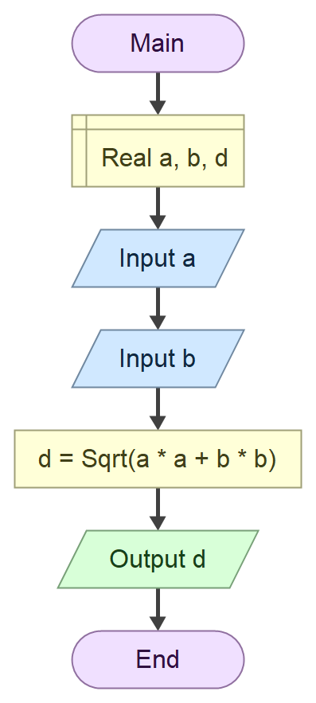

# Domaci zadtak iz tehnicke dokumentacije

## zadatak

Program koji na osnovu unetih **stranica** pravougaonika `a` i `b` izracunava duzinu **dijagonala** pravougaonika `d`

## Formula 

$$
\(d = \sqrt{a^2 + b^2} \)
$$

### algoritamska sema



## Resenje

```cs
using System;

namespace DijagonalaPravougaonika
{
    class Program
    {
        static void Main(string[] args)
        {
            double a, b, d;

            Console.Write("Unesi stranicu a: ");
            a = Convert.ToDouble(Console.ReadLine());

            Console.Write("Unesi stranicu b: ");
            b = Convert.ToDouble(Console.ReadLine());

            d = Math.Sqrt(a * a + b * b);

            Console.WriteLine("Duzina dijagonale pravougaonika je: " + d);

            Console.ReadKey();
        }
    }
}
```

### Test primeri

Test primer 1:

```text

Unesi stranicu a: 12
Unesi stranicu b: 16
Duzina dijagonale pravougaonika je: 20

C:\Users\ognje\source\repos\ConsoleApp4\ConsoleApp4\bin\Debug\ConsoleApp4.exe (process 9892) exited with code 0 (0x0).
To automatically close the console when debugging stops, enable Tools->Options->Debugging->Automatically close the console when debugging stops.
Press any key to close this window . . .
```

Test primer 2:

```text

Unesi stranicu a: 16.52
Unesi stranicu b: 24.13
Duzina dijagonale pravougaonika je: 29.2432436641355

C:\Users\ognje\source\repos\ConsoleApp4\ConsoleApp4\bin\Debug\ConsoleApp4.exe (process 26776) exited with code 0 (0x0).
To automatically close the console when debugging stops, enable Tools->Options->Debugging->Automatically close the console when debugging stops.
Press any key to close this window . . .
```

### Objekti

| Redni broj | Naziv promenljive | Tip promenljive |
| -----------| ------------------| ----------------|
| 1.         | `a`               | `double`        |
| 2.         | `b`               | `double`        |
| 3.         | `d`               | `double`        |


